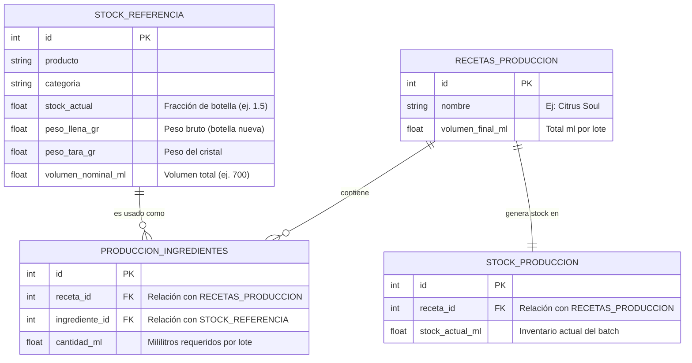
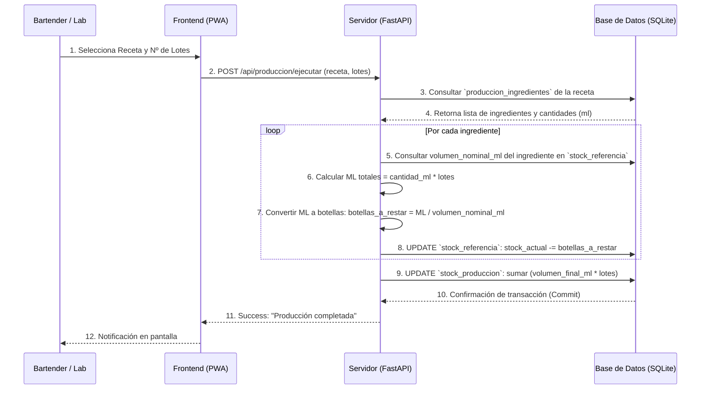

# Arquitectura Sistema Inventario Hostelería (Producción Lovo)

Este documento detalla la estructura de la base de datos y el flujo de procesos del módulo de Producción, diseñado para explicar técnicamente cómo se gestionan los stocks, las recetas y el pesaje.

## 1. Estructura de la Base de Datos (Entidad-Relación)

A continuación, se muestra el modelo relacional que permite conectar el inventario general con las producciones de laboratorio.



## 2. Diagrama de Flujo: Ejecución de una Producción

El siguiente diagrama explica el proceso algorítmico que ocurre en el servidor cuando el equipo decide preparar un lote de producción (ej. cocinar un sirope).



## 3. Diagrama de Flujo: Sistema de Pesaje (Báscula)

Este proceso detalla cómo la aplicación convierte el peso físico (en gramos) a un formato de inventario decimal (botellas).

```mermaid
flowchart TD
    A[Botella en Báscula] --> B(Ingresar Peso en PWA)
    B --> C{¿Tiene Tara configurada?}
    C -- Sí --> D[Calcular Peso Neto: Peso Báscula - Tara]
    C -- No --> E[Error: Configurar Pesos Primero]
    D --> F[Calcular Peso Líquido Total: Peso Llena - Tara]
    F --> G[Calcular Porcentaje: Peso Neto / Peso Líquido Total]
    G --> H[Multiplicar Porcentaje * Volumen Nominal (ml)]
    H --> I[Resultado: Fracción de Botella y ML restantes]
    I --> J((Actualizar Stock))
```

## 4. Notas Técnicas
- **Atomicidad:** Todo el proceso de descuento de stock de múltiples ingredientes y suma del producto final se ejecuta en una única transacción de base de datos (`commit` o `rollback`). Si falla un ingrediente, no se altera ningún dato.
- **Trazabilidad de Peso:** Al disociar el peso del cristal (tara) del peso bruto, evitamos desviaciones provocadas por los diferentes grosores de vidrio de cada fabricante.
