# Lovo Inventory System - Propuesta de Valor y Arquitectura

## Resumen Ejecutivo
El Lovo Inventory System es una solución tecnológica que he diseñado desde dentro, para revolucionar cómo hago los inventarios en el local. A través de una Aplicación Web Progresiva (PWA) y un sistema de Reconocimiento de Voz Nativo que he programado, el proceso de conteo de botellas pasa de ser una tarea tediosa de varias horas para mí, a una experiencia fluida, rápida y con menor margen de error humano.

## Propuesta de Valor
1. Velocidad: No necesito teclear. Simplemente dicto "1.4 Brugal" o "3 Coca-colas" y el sistema lo procesa al instante.
2. Corrección Inteligente: He integrado algoritmos de coincidencia (Distancia de Levenshtein) para que el sistema entienda mi pronunciación o nombres imprecisos (ej. transforma "brugau" en "Ron Brugal").
3. Instalable sin App Store: Al haberlo desarrollado como una PWA, lo instalo directamente en mi móvil como una app nativa, sin depender de los costes ni tiempos de aprobación de las tiendas.
4. Exportación Inmediata: He programado la generación de archivos Excel estandarizados, listos para contabilidad con un solo clic.

---

## Arquitectura Tecnológica
He construido el sistema bajo una arquitectura moderna cliente-servidor:

* Frontend (El Cliente - PWA): Construido con HTML5, CSS3 y JavaScript moderno (Vainilla para máxima velocidad). Interfaz responsiva, modo oscuro y acceso nativo al micrófono de mi dispositivo a través de la Web Speech API.
* Backend (El Cerebro - API): Lo he desarrollado en Python utilizando el framework FastAPI por su extrema rapidez y rendimiento. 
* Base de Datos: Almacenamiento seguro mediante SQLite3 (preparado para migrar a PostgreSQL en entorno multi-local). Esto asegura que pueda dictar inventario de manera rápida y segura sin corrupciones de datos en el servidor, e incluso soportar que varios de mis compañeros escaneen a la vez si nos dividimos el trabajo.

---

## Diagrama de Flujo del Sistema

A continuación se muestra el ciclo de vida de un escaneo de inventario que realizo:

```mermaid
sequenceDiagram
    actor Yo (Camarero)
    participant PWA (Móvil)
    participant Backend (Python)
    participant Base Datos (SQLite)
    
    Yo->>PWA: Toco botón y dicto "1.5 Brugal"
    Note over PWA: Web Speech API convierte<br/>mi voz a texto en tiempo real
    PWA->>PWA: Limpia el texto ("uno punto cinco brugal" -> "1.5 brugal")
    PWA->>PWA: Algoritmo Inteligente busca coincidencias en el histórico
    PWA->>Backend: Envia POST /api/registro {1.5, "Ron Brugal", Categoria}
    Backend->>Base Datos: INSERT en tabla 'registros'
    Base Datos-->>Backend: OK
    Backend-->>PWA: Confirmación de guardado (HTTP 200)
    PWA-->>Yo: Notificación Visual y Sonora (Beep)
    
    rect rgb(30, 41, 59)
    Note over Yo,Base Datos: FASE DE EXPORTACIÓN (FIN DEL TURNO)
    Yo->>PWA: Pulso "Descargar Excel"
    PWA->>Backend: GET /api/descargar/hoy
    Backend->>Base Datos: Extrae mis datos del día actual
    Backend->>Backend: Genera XLSX dinámico separado por pestañas
    Backend-->>PWA: Archivo .xlsx
    PWA-->>Yo: Descarga completa en mi móvil
    end
```

## Escalabilidad a Futuro (Fase 2)
He preparado el sistema para que pueda escalar a una arquitectura Multi-Tenant y gestionar todos los locales del grupo si lo deseamos expandir.
- Panel de Administración Central (Dashboard) para gerencia.
- Diccionarios de voz personalizados por restaurante (ej. platos en restaurantes, licores en coctelerías).
- Base de datos relacional robusta en la Nube (PostgreSQL).
